# Extend Azure Data Factory Module

## Decision
Currently, [data-plane-azure-data-factory](https://github.com/eclipse-edc/Connector/tree/main/extensions/data-plane/data-plane-azure-data-factory) extension only supports Azure blob as both storage and destination.
Data Factory is able to support over 80 [connectors](https://learn.microsoft.com/en-us/azure/data-factory/connector-overview), such as Blob, S3, GCS, and Big Query. It would be advantageous to make the extension more flexible and able to support additional connectors.
One of the scenarios is to support Blob to [Dataverse](https://learn.microsoft.com/en-us/power-apps/maker/data-platform/data-platform-intro#dynamics-365-and-dataverse). Dataverse includes a base set of standard tables that cover typical scenarios, CSV file in the blob can be transferred into a Dataverse table. Then users can then use Power Apps to build rich applications that use this data.

## Sequence Diagram
The following sequence diagram describes the flow to transfer a blob from a provider storage account to a consumer dataverse table.

## Dataverse Authentication
There are three kinds of [authentication types](https://learn.microsoft.com/en-us/azure/data-factory/connector-dynamics-crm-office-365?tabs=data-factory#dynamics-365-and-dynamics-crm-online):
- AADServicePrincipal
- Office365: username, password
- ManagedIdentity

We use Azure AD Service Principal to authenticate Dataverse, similar to how Blob uses SAS (write-only SAS, with a 1-hour validity and limited access to only one container).
With the service principal, we can limit the secret's expiration to only one hour and grant the least privilege necessary, such as read-write permission on the destination Table.
Using the service principal secret, the provider can write data to the consumer's Table.

## Managed resources
We support managedResources as `false`.
In the case of Blob to Blob, only managedResources as `true` is supported, as a new container and a SAS will be created each time.
In the case of Dataverse, it is hard to create a table on demand because the entities have different schemas. So we use pre-existing table and service principal.

## Data transfer
We will support data transfer from CSV file in Blob to a single Dataverse table as minimal. In the future, other file formats such as JSON, and Excel can also be supported. CSV file and Dataverse Table should have the same schema. Otherwise, there will be an error when writing data to Dataverse.